# Smart Solar Street Lighting System (SSSLS)

## 1. Project Introduction (The Core Idea)

The **SSSLS** project is an **Internet of Things (IoT)** solution designed to optimize the use of renewable energy for street lighting. The system works **stand-alone**, fully powered by a **Solar Panel** and **Battery**, and is controlled by an **ESP8266 Microcontroller** with two main functions:

1.  **Smart Automation:** Reads field data (**LDR Sensor**) to turn on the lamp automatically at dusk/night.
2.  **Remote Control:** Connects to an **MQTT Broker** via **Wi-Fi** for status monitoring and remote force ON/OFF control from a central dashboard.

The main goal is to achieve **maximum energy efficiency** and provide **flexible, centralized infrastructure management**.

## 2. Main Components and Their Roles

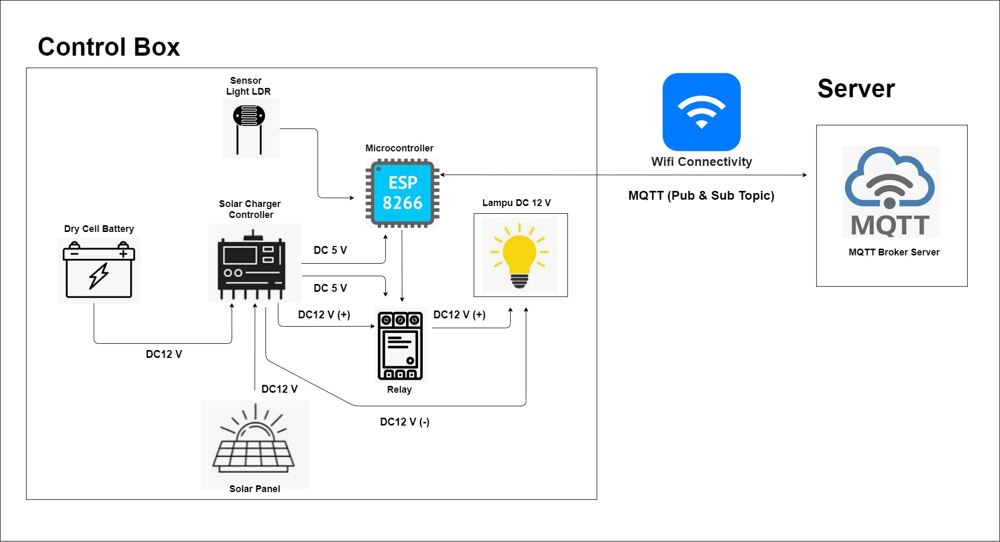 

Below are the key roles of each component in the **Control Box** and Server:

| Component | Main Role | Working Voltage |
| :--- | :--- | :--- |
| **Solar Panel** | Main energy source (DC electricity from sunlight). | DC 12V (varies) |
| **Dry Cell Battery** | Main energy storage to power the light overnight. | DC 12V |
| **Solar Charger Controller (SCC)** | **Power Regulator & Safety.** Manages charging and provides stable DC output (12V & 5V). | Input 12V, Output **12V** & **5V** |
| **LDR Light Sensor** | **Optical sensor** for determining day/night conditions. | Analog Signal |
| **Microcontroller (ESP8266)** | **System Brain.** Processes data and manages network communication (Wi-Fi/MQTT). | DC 5V (via SCC) |
| **Relay** | **High Power Actuator.** Switches the high current (12V) circuit for the lamp. | Control 5V, Switch 12V |
| **DC 12V Lamp** | Main load for street lighting. | DC 12V |
| **MQTT Broker Server** | **Pub/Sub Communication Center.** Real-time message handling. | TCP/IP |

## Visual Device Photos

Below are the key installation of each component in the **Control Box** and Server:

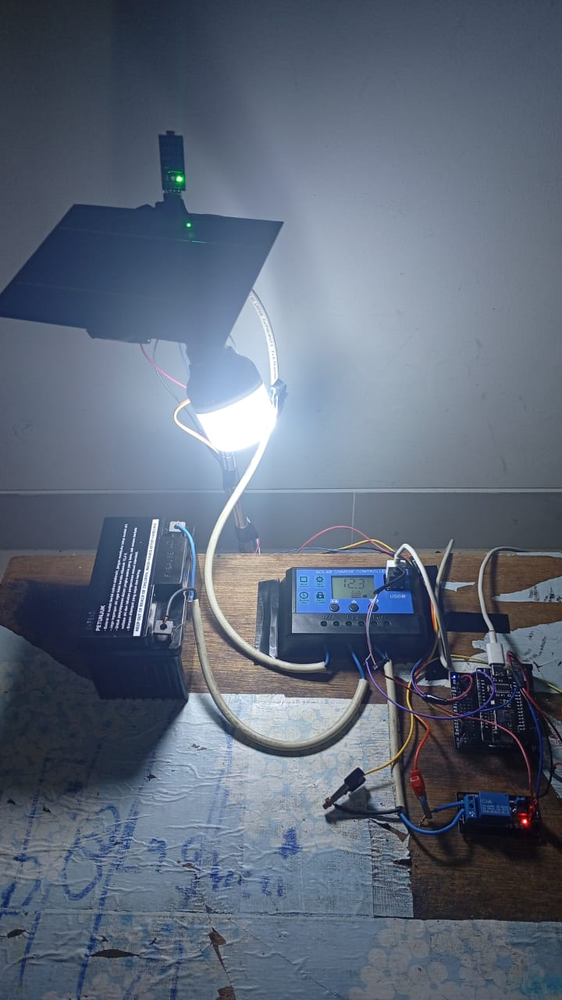

| Area/Komponen | Foto Komponen |
| :--- | :--- |
| **Solar Panel** | 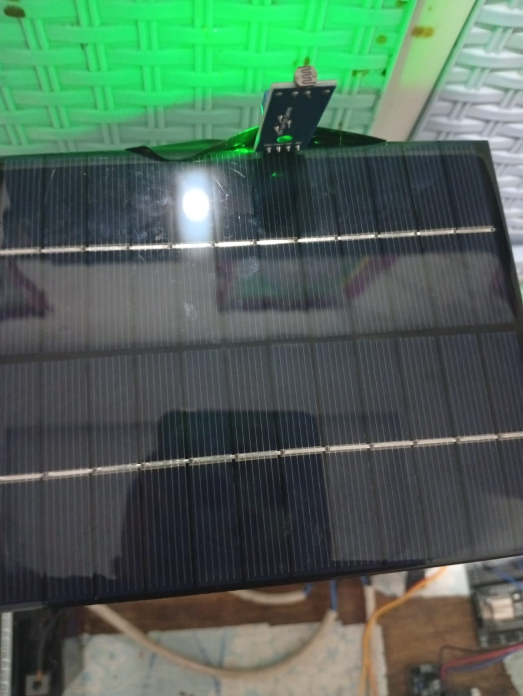  |
| **Dry Cell Battery** |   |
| **Solar Charger Controller (SCC)** | 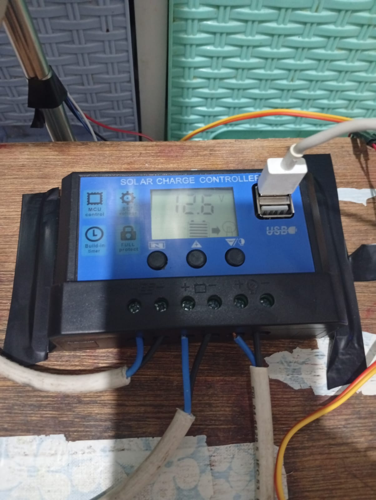  |
| **LDR Light Sensor** | 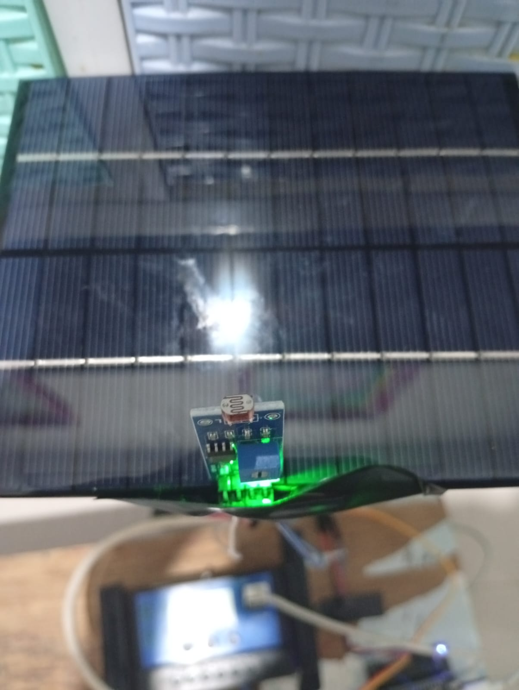  |
| **Microcontroller (ESP8266)** |   |
| **Relay** | 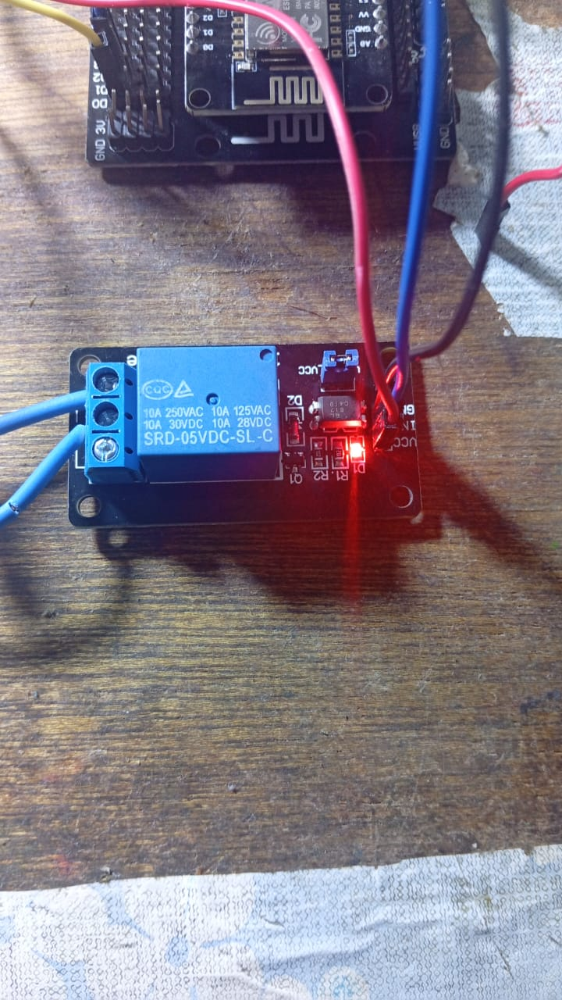  |
| **DC 12V Lamp** | 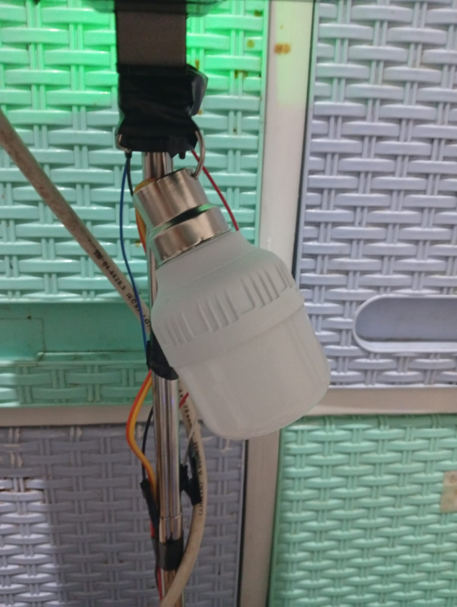  |

## 3. ESP8266 Pin Wiring Guide

Proper wiring is very important, especially for power:

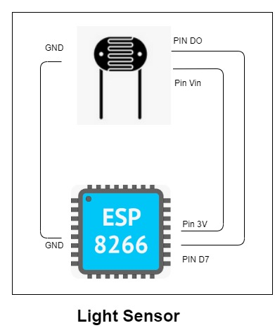

### A. Power & Ground Connection
* **VCC:** ESP8266 **VCC** pin connects to **DC 5V output** from the **Solar Charger Controller (SCC)**.
* **GND:** Make sure all **GND** pins (ESP8266, Relay, SCC) are connected to **Common Ground**.

### B. Sensor Input (LDR)
* **LDR:** Connect the LDR in a **Voltage Divider** circuit.
* **Pin:** The middle point of the divider connects to **A0** pin on ESP8266.
* **Logic:** In code, the analog value (0-1023) is used to determine day/night threshold.

### C. Control Output (Relay)
* **Relay Signal:** Relay signal pin (e.g. IN) connects to one of the **Digital Output (GPIO)** pins on ESP8266.
* **Recommended Pins:** **GPIO4 (D2)** or **GPIO5 (D1)**.
* **Function:** HIGH signal (3.3V) from ESP8266 activates the relay, which then switches the DC 12V circuit to the lamp.

## 4. Wi-Fi and Sectoral Installation Design

This system uses a **Sectoral** network strategy for scalability and stability:

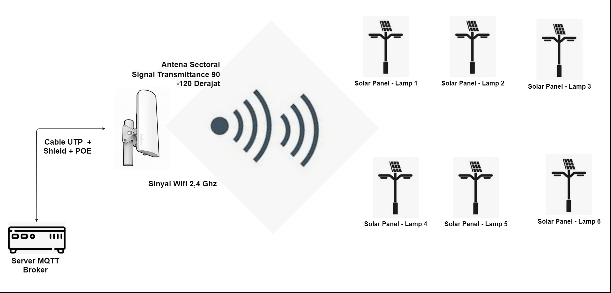

1.  **Sector:** The area is divided into small clusters. Each cluster is supported by a stable **Wi-Fi Router/Gateway**.
2.  **Signal Efficiency:** Each *Smart Lamp Node* (ESP8266) connects to the nearest sector router. This minimizes range and signal strength issues in large areas.
3.  **Reliability:** This strategy allows maintenance and troubleshooting to be isolated per sector.

## 5. AP Connection Flow (Provisioning) and SSID Credentials

This process is important for device configuration in the field (over-the-air):

 **1. Failed Init** | **AP Mode (Access Point)**  On first boot or failed Wi-Fi connect, ESP8266 broadcasts a unique SSID (e.g. `SSSLS_Config_XXXX`). 

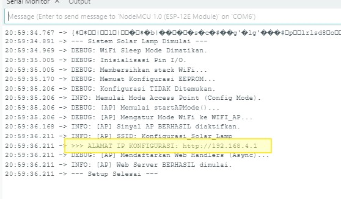

**2. Access Web Portal** | **AP Mode** | Technician connects to this SSID and opens the **Web Portal** (usually at `192.168.4.1`) to enter Wi-Fi credentials. 

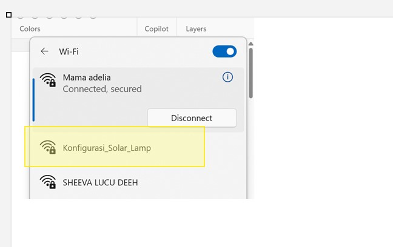

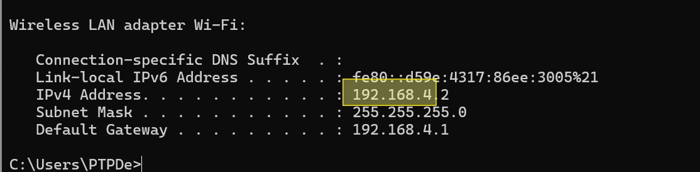

**3. Configuration** | **AP Mode** | Input **SSID** and **Sector Router Password** and **MQTT Broker** credentials. 

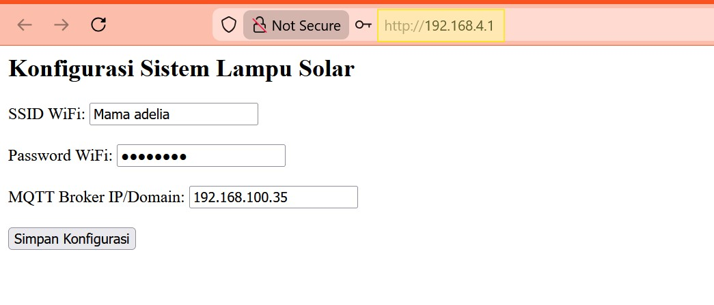

**4. Storage** | **EEPROM/SPIFFS** | Credentials are saved to non-volatile memory. 

**5. Final Transition** | **AP Mode (Access Point)** | ESP8266 reboots and automatically connects to the sector router. 

**6. Reset To Access Point ** | **AP Mode (Access Point)** | 

Set Jumper PIN from Pin D0 to GROUND and start microcontroller

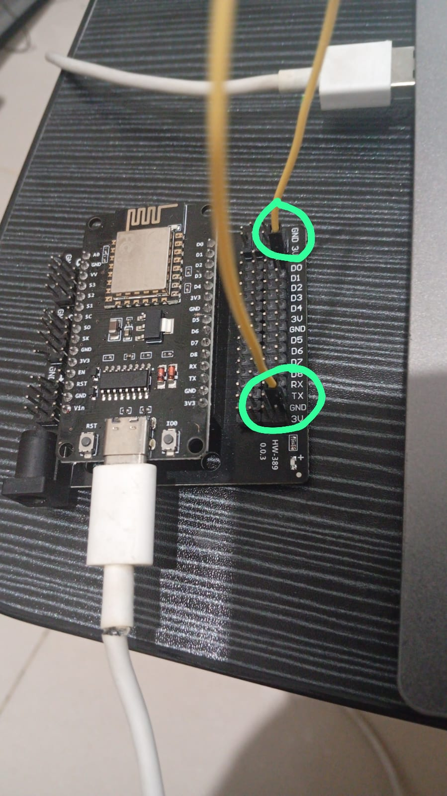

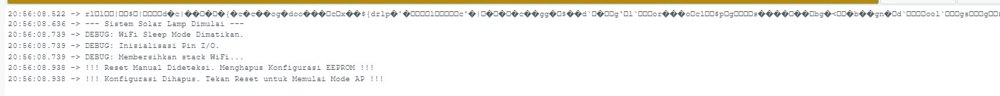

## 6. Station (STA) Connection Flow to MQTT Broker

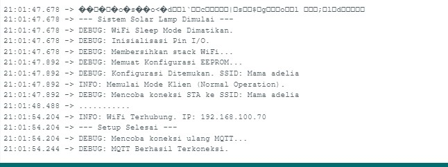

After connecting to Wi-Fi, IoT communication works as follows:

1.  **MQTT Connection:** ESP8266 creates an **MQTT Client** connection to the **MQTT Broker Server** address.
2.  **Publish (Send Telemetry):**
    * Periodically, ESP8266 reads **LDR** value and internal status.
    * Data is sent (published) to a unique status topic: `sssls/sectorB/node10/status` (Payload: JSON or string).
3.  **Subscribe (Receive Command):**
    * ESP8266 **subscribes** to its control topic: `sssls/sectorB/node10/control`.
    * Received messages (e.g. *force_on* command) trigger a callback function to control the **Relay** directly.

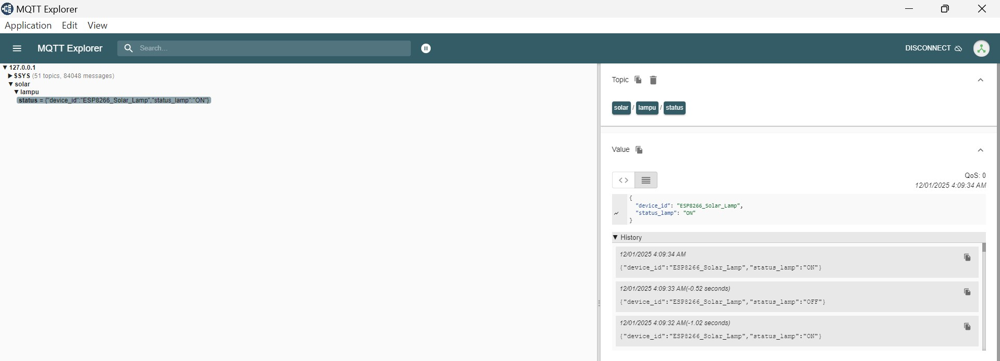
